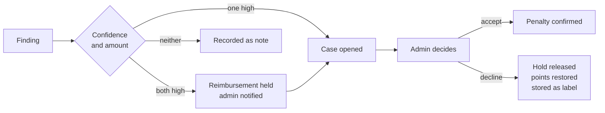
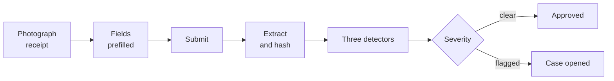
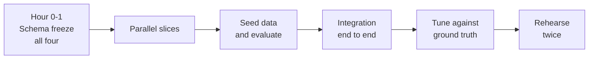

# AuditX PRD

A financial hygiene score and spend auditor for companies too small for a finance team

2026-09-19 · @Someone

## Summary

AuditX detects expense and timesheet fraud inside companies of 20 to 100 employees, which are large enough for submissions to go unchecked and too small to employ anyone to check them.

Employees submit expenses with receipt images and weekly timesheets. Three detectors run on every submission: duplicate receipts, abnormal expenses, and suspicious timesheets. High-confidence findings place a reversible hold on the reimbursement and notify an administrator immediately. Everything else opens a case in a review queue. An administrator accepts or declines each case, and those decisions feed back into the system.

Built on NVIDIA NIM. Nemotron models extract receipt data, resolve merchants, and write investigation briefs. They never decide whether fraud occurred and never produce a score.

## Problem

Expense and time fraud is common, small per incident, and almost never caught in companies of this size.

Below about 20 people, a founder reads every submission. Above about 100, there is a controller and an expense platform with a policy engine. In between, submissions are approved in batches by someone doing it between other work, and the approval is effectively a rubber stamp. What gets through:

- the same receipt submitted twice, months apart, or by two people who shared a meal
- claims that drift upward because nobody is comparing this month to last month
- timesheet hours that overlap, repeat verbatim, or contradict where the person demonstrably was
- occasional deliberate padding, which looks exactly like the above until someone looks closely

The existing tools do not fit. Expense platforms such as Ramp and Expensify enforce policy at submission and assume a human reviews what passes. Accounting software records without judging. Enterprise audit tools price and scope for companies ten times larger. Nothing sits in the gap, reads what was actually submitted, and tells one overworked administrator which five of four hundred submissions deserve attention this week.

## Target user

Two roles, two interfaces, opposite relationships to the system. One is measured by it. The other acts on it.

| | Employee | Administrator |
|---|---|---|
| Typical role | Anyone who spends or logs hours | Office manager, ops lead, founder |
| Finance training | None | None |
| Time in the product | 3 minutes per submission | 20 minutes a week |
| Uses it to | Submit an expense or a timesheet, see their own status and score | Work the case queue, decide, reverse holds, watch the trend |
| Needs | A fast submission flow, and a plain reason when something is held | A ranked queue, evidence in one place, a decision in under 30 seconds |
| Fails if | They are flagged without explanation, or cannot see their own record | Flags are too vague to act on or too numerous to work through |

The employee is not a secondary user. They are the person the system makes judgements about, which makes their view of it a requirement rather than a courtesy. They see their own score, their own findings, and the reason for anything held.

Design consequence: submission must be fast enough that nobody avoids it, and the queue must be workable in short sittings.

## Goals and non-goals

### Goals

1. Catch duplicate receipts, abnormal expenses and suspicious timesheets accurately enough that an administrator trusts the queue.
2. Find at least one class of problem no single-purpose tool can find, by holding expense and timesheet data together.
3. Give the administrator a decision-ready case: evidence, plain-language explanation, review steps, and plausible innocent explanations.
4. Keep every consequence reversible and every action audited.
5. Show the employee what the system says about them.

### Non-goals

| Not building | Why |
|---|---|
| Deciding whether fraud occurred | The system surfaces patterns. Intent is a human judgement and always will be. The model is explicitly forbidden from concluding it. |
| Payroll deductions or fines | Holds pause reimbursements. Nothing touches wages. Wage deduction on an algorithmic flag is legally restricted and ethically wrong. |
| Automatic disciplinary escalation | A score ranks a queue. It never triggers an action on its own. |
| Policy enforcement at submission time | We detect after submission. Blocking at entry is a different product. |
| Vendor-side spend auditing | The previous version of this product. Now a secondary detector at best. |
| Multi-currency, multi-entity | Out of scope. |

## Success metrics

### For the hackathon

- A duplicate receipt submitted live places a hold and increments the administrator's notification badge without a page refresh
- The location-conflict case is explicable to a non-technical judge in under 60 seconds
- A near-miss case is dismissed live, showing the system does not simply flag everything
- Every finding traces to a rule id and raw evidence in two clicks
- The demo runs with the network unplugged, on cached model responses

### For the product

| Metric | Target | Why |
|---|---|---|
| Precision on anything that can place a hold | Above 0.90 | A wrong hold against a named employee is the failure that ends the product. |
| Overall recall across the three detectors | Above 0.70 | Missed findings cost money that was already being lost. Recoverable. |
| Case decision time | Under 30 seconds median | Above this, the queue goes unworked and the whole loop dies. |
| Queue completion within 14 days | Above 70% | An unworked queue means stale scores and no feedback signal. |
| Hold reversal rate | Between 10% and 25% | Zero means the threshold is too high and holds are rubber-stamped. Above 25% means it is too low. |

That last metric is the honest one. A reversal rate of zero is not a sign the system is perfect. It is a sign nobody is really reviewing.

Precision is prioritised over recall throughout. The asymmetry is deliberate: a missed finding costs money, a false accusation costs a person.

## Core concepts

### 1. Three detectors, chosen for different reasons

| Detector | Catches | Chosen because |
|---|---|---|
| Duplicate receipts | Same receipt twice, by one person or two. Exact file match, perceptual image match, semantic field match. | Highest precision, so it is safe to place a hold on. |
| Abnormal expenses | Amounts far outside the employee's own history or their peer group's. Category mismatch, velocity spikes, off-pattern timing. | Highest volume, so it fills the queue and makes the review loop demonstrable. |
| Suspicious timesheets | Overlaps, copy-pasted weeks, impossible hours, and hours contradicted by a receipt elsewhere. | Nobody else will have built it, and it contains the cross-signal rule below. |

Everything else is secondary or mocked behind a working interface.

### 2. The cross-signal rule

Hours logged at one location while a receipt places the employee in another city the same day. No timesheet tool can find this. No expense tool can find it. It exists only because both data sources sit in one system, and it is the single strongest argument for the product existing.

The matching near-miss is equally important: an employee legitimately working remotely from another city who set the location field honestly. The detector must read the declared location rather than assume the office.

### 3. Holds, not fines

A hold pauses a reimbursement that has not been paid. It is not a payroll deduction and not a fine. Wage deduction triggered by an automated rule is restricted by law in most US states and is the wrong mechanism regardless. The user experience is identical and the legal exposure is not.

Reversal is one click, audited, and notifies the employee.

### 4. Scoring

Every employee starts at 100. Confirmed findings subtract points on a six-month half-life. Pending cases apply 35% of their penalty, capped at 15 points, escalating toward full weight after 14 days so an unworked queue cannot quietly clear everyone.

Scores roll up to department and to category. Downward movement is capped at 15 points per month, because one bad week should not make someone look like a career offender.

Nothing escalates automatically. The score ranks the queue. Every consequence passes through a human decision, and every decision is audited.

## Requirements

Three tiers. Tier 1 must ship. Tier 2 ships if the MVP is stable. Tier 3 is mocked behind a real interface so the UI is complete and the later swap is one line.

### Tier 1

| # | Requirement | Acceptance |
|---|---|---|
| 1 | Login as employee or administrator, role enforced server side | An employee session cannot read another user's expense by editing a URL |
| 2 | Employee submits an expense with a receipt image | Stored, hashed both ways, extracted, visible only to them and admins |
| 3 | Employee submits a weekly timesheet | Day grid with times, hours, project and location |
| 4 | Receipt extraction via Nemotron vision | 8 of 10 fixture receipts return correct merchant and total; degraded ones do not crash |
| 5 | Duplicate receipt detection, four layers | Precision above 0.90 on the seeded set; zero findings on the recurring parking near-miss |
| 6 | Abnormal expense detection against self and peer baselines | Injected drift fires; the legitimate $3,200 conference ticket does not exceed a note |
| 7 | Suspicious timesheet detection including location conflict | All four injected conflicts fire; the honest remote-work case does not |
| 8 | Two-axis severity, scoring, cases and reversible holds | Golden-file test to two decimal places; reversal restores the prior score exactly |
| 9 | Administrator queue, employee table, employee detail, documents view | Dashboard to decision in three clicks |
| 10 | Real-time notification on immediate hold | Badge increments in a second window with no refresh, and recovers after a network drop |
| 11 | Four Recharts views: anomaly trend, leakage, severity mix, spending history | Each renders from the stats endpoint |
| 12 | Synthetic dataset with injected fraud and near-misses | `evaluate` prints per-rule precision and recall against ground truth |

### Tier 2

| # | Requirement |
|---|---|
| 13 | Employee-facing "why was this flagged" question answering |
| 14 | Invoice ingestion and vendor-side detectors |
| 15 | Threshold tuning from accumulated declined-case labels |
| 16 | Case file export as PDF |
| 17 | Bulk decide on the queue |

### Tier 3, mocked

| # | Requirement |
|---|---|
| 18 | Vendor overlap and zombie subscription detection |
| 19 | Mileage and per-diem checks |
| 20 | Policy document upload with rule extraction |
| 21 | Slack and email notification delivery |
| 22 | Multi-currency |

## User flows

### Employee submits an expense

Extraction prefills merchant, date and total so the employee corrects rather than types. This is the difference between a product people use and one they work around, and correction data is also a free accuracy signal.

When something is held, the employee sees it on their own dashboard with the reason in plain language. They find out from the product, not from an awkward conversation later.

### Administrator works the queue

Cases sorted by amount at risk descending. One card at a time showing the investigation brief, the evidence, the recommended review steps, the neutral questions to ask, and at least two plausible innocent explanations. Accept or decline with a note. Scores animate on decision.

The innocent-explanations field is not politeness. It is what keeps the reviewer making a judgement instead of confirming a verdict the system already reached.

Constraint: a card must be decidable in under 30 seconds without opening anything else.

### Administrator investigates a person

From the employee table, sorted by amount at risk. Their detail page shows score history, every submission, every finding with its explanation, and a timeline. The timeline is what makes a pattern visible, since three small flags over three months read very differently from three in one week.

### Employee checks their own record

Score, six-month sparkline, every finding against them, plain reason, and anything currently held. In Tier 2 they can ask why something was flagged and get a grounded answer.

Building a scoring system on people and hiding the score from them is the difference between a product that helps and one that should not be deployed.

## Technical constraints

### Stack

Next.js 15 App Router with TypeScript strict mode, Tailwind and Recharts for everything a user touches, including auth, uploads, CRUD and notifications. A Python FastAPI service owns extraction, detection, scoring and the investigator. Prisma and Postgres, with SQLAlchemy models generated from the same schema so both services agree.

Python earns its place because perceptual image hashing, robust statistics and the Faker generator are all substantially easier there. Both services share one database, which is not a production pattern and is the right call for a two-day build. Name it as a deliberate trade rather than let a judge find it.

### Models

| Job | Model |
|---|---|
| Receipt extraction | `nvidia/nemotron-3-nano-omni-30b-a3b-reasoning` |
| Investigator: briefs, summaries, review steps, question answering | `nvidia/nemotron-3-super-120b-a12b` |
| Receipt similarity and merchant resolution | NeMo Retriever embeddings |
| Category assignment | `nvidia/nemotron-3-nano-30b-a3b` |

All through the hosted NIM API, which is OpenAI wire compatible.

### On Gemini

`gemini-3.8-flash` was considered for the investigator and would do the job well. It is not the default because the investigator is the AI layer a judge actually looks at, and putting it on Google while NVIDIA does invisible background work meets the hackathon requirement on paper and loses the argument in the room.

It is implemented behind the same `InvestigatorProvider` interface, selected by environment variable. Roughly forty lines, and it buys a fallback if NIM rate-limits mid-demo plus an honest answer about why this model was chosen.

### The model boundary

The model never decides whether fraud occurred, never assigns severity, never produces a score. Rules produce findings, confidences and penalties. The model extracts, explains, summarises and suggests review steps.

That constraint is written inside every prompt, not only in the code, because a model told its job is to find fraud will find fraud. The prompts forbid the words fraud, theft and guilty, and require at least two plausible innocent explanations in every brief.

Delete every model-written word in the database and the scores are unchanged.

### Reliability

Every response is schema-validated, one retry, then a deterministic fallback: extraction falls back to the employee's entered fields, category to Other, briefs to a template built from the evidence. The product works with the model unreachable. Test it by unplugging the network before the demo.

Extraction is cached by receipt hash, category by merchant name, briefs by finding id. A 2,700-expense dataset should cost a few hundred calls.

### Privacy and injection

Card numbers reduce to last four, account and routing numbers are stripped, and employee names become pseudonymous ids before anything reaches the model. Redaction happens during normalisation, not at the API boundary, so no code path can skip it.

Receipt images are user-supplied and a rendered image can carry injected instructions. Extraction only ever produces a schema-validated structure, so injected text lands in a string field and goes nowhere. Extracted text is never fed back as instructions.

## Scope

### In the build

One organisation, one currency, English receipts. Two roles. Expense and timesheet submission. The three Tier 1 detectors. Cases, reversible holds, real-time notifications, four Recharts views. A 45-employee synthetic dataset over six months with injected fraud and deliberate near-misses.

### After

1. Tuning thresholds from accumulated declined-case labels, which is the first thing real usage unlocks
2. Employee-facing question answering about their own findings
3. Vendor-side detectors, the v1 product, as a secondary module
4. Policy document upload with rule extraction, so each company's actual rules drive the thresholds
5. Integration with an expense platform so submissions arrive without a separate app

Everything on that list needs either real users or integration work. None of it is buildable this weekend, and scoping it out deliberately is a better answer than implying otherwise.

## Risks

### The risk that matters most

This product makes judgements about named people. A false positive is not an accuracy problem, it is an accusation. Every mitigation below follows from that.

| Risk | Mitigation |
|---|---|
| A wrong hold against an innocent employee | Precision prioritised over recall throughout. Only high confidence and high amount places a hold. Reversal is one click. |
| The system reads as a prosecution | Briefs require at least two plausible innocent explanations. Prompts forbid the words fraud, theft and guilty. Questions phrased as requests for information. |
| Employees are scored without seeing the score | Employee dashboard shows their score, history, findings and reasons. |
| Automated penalties become automated consequences | Nothing escalates past a reversible hold. Every consequence passes through an audited human decision. |
| An administrator rubber-stamps the queue | Hold reversal rate is a tracked metric. Zero reversals means nobody is reviewing. |

### Questions judges will ask

Rehearse these. All have real answers, and being caught without one is worse than the weakness itself.

1. **"Is the model deciding who committed fraud?"** No. Rules produce findings and penalties, the model explains them. Delete every model-written word and the scores are identical. The constraint is written into the prompts, not just the code.
2. **"What happens when you flag someone who did nothing wrong?"** A hold, not a fine. One click reverses it, the employee is notified, the score is restored, and the case becomes a training label. The reversal rate is a metric we watch.
3. **"Why NVIDIA rather than a general-purpose model?"** Four load-bearing uses, not decoration: vision extraction, the investigator, retrieval embeddings feeding duplicate detection, and category assignment. Gemini is implemented behind the same interface and benchmarked.
4. **"How do you know your detectors work?"** Synthetic data with ground truth, per-rule precision and recall, and a deliberate near-miss set the detectors must not fire on.
5. **"Is this employee surveillance?"** It reads submissions the company already receives. It does not track location, monitor activity, or read anything the employee did not submit. The employee sees everything the system says about them.

### Build risks

| Risk | Mitigation |
|---|---|
| Wage deduction exposure | Holds pause unpaid reimbursements. Nothing touches payroll, by design. |
| An unworked queue leaves everyone looking clean | Pending findings hold 35% of their penalty, escalating to full weight after 14 days. |
| Schema churn late in the build | Freeze `Expense`, `Timesheet` and `Finding` in hour one |
| Two services, integration pain | Shared database, generated models, one docker-compose |
| NIM rate limits during the build | Cache extraction by hash, category by merchant, briefs by finding id |
| Live demo failure | Cached responses, seeded database, recompute button, rehearsed offline |
| Detectors tuned to the demo data only | Run `evaluate` before tuning anything, including the near-miss set |

## Open questions

Decide as a team. Each changes what someone builds.

- [ ] **Does the employee see their score as a number, or only their findings?** The number is more transparent and also more likely to feel like being graded.
- [ ] **Who gets the immediate-hold notification when there are several administrators?** All of them, or a rotation.
- [ ] **Does a declined case disappear or stay visible as a marked false positive?** Keeping it helps tuning and is worse for the employee reading their own page.
- [ ] **Does location conflict need a geocoder?** A city string match is enough for the seed data and will fail on real merchant names.
- [ ] **Is the peer group the department, or the job title?** Department is easier and noisier. Title is better and often too small to use.

## Team and milestones

Four vertical slices. Each demoable alone so nobody blocks waiting.

| Owner | Slice | Done when |
|---|---|---|
| 1 | Auth, roles, employee submission, upload and extraction | An employee submits an expense with a receipt and a timesheet for a week, visible only to them and admins |
| 2 | The three detectors and baselines | Given submissions, produces findings with confidence, evidence and amount at risk |
| 3 | Scoring, cases, holds, notifications, API routes | Golden-file scoring test passes; reversal restores the prior score exactly |
| 4 | Admin dashboard, Recharts, case queue, seed data, demo | The thing on the projector |

### Sequence

Seed data comes before integration rather than after, which is the opposite of the instinct. Owner 2 cannot tune a detector without it and owner 4 cannot build a chart against an empty database.

### Rules that save the weekend

1. Freeze `Expense`, `Timesheet` and `Finding` at the end of hour one. Announce it. Changes need all four to agree.
2. Owner 3 writes the golden-file scoring test before the scorer.
3. Owner 2 builds duplicate receipts first, since it is the highest precision and the easiest to demonstrate, then goes straight to the location conflict rule.
4. Owner 4 builds against fixtures from hour one rather than waiting for a working backend.
5. Run `evaluate` before tuning anything. Tuning by eye against demo data produces a system that works only on demo data.

## Demo

Five minutes. Rehearse twice, once with the network unplugged.

1. Log in as an employee, submit a lunch receipt, watch it extract and clear
2. Submit a receipt someone else already claimed. Hold fires, admin's badge increments live
3. Switch to admin, open the case, read the brief, the evidence, the review steps
4. Show the location conflict: office hours logged, receipt from another city, same Tuesday
5. Decline a near-miss case live, reverse the hold, watch the score come back
6. Land on the dashboard: leakage prevented, severity mix, anomaly trend

Step 5 is the one most teams will skip and the one that proves the system is fair rather than merely sensitive.
