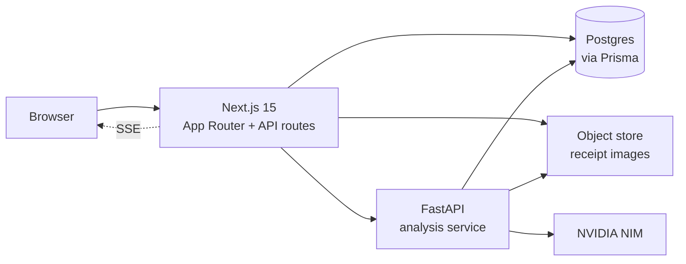
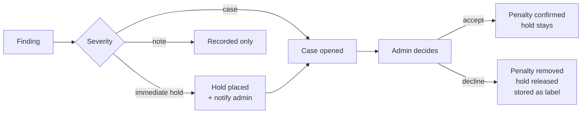

# System design

## Services



Two deployables. Next.js owns everything a user touches: auth, pages, uploads, CRUD, notifications. The analysis service owns extraction, detection, scoring and the investigator. They share the database, which is the pragmatic hackathon choice and one you should name as a deliberate trade rather than let a judge find it.

Why Python at all when the frontend is TypeScript: perceptual image hashing, robust statistics and the Faker generator are all substantially easier there. The alternative is everything in TypeScript with `sharp` for hashing, which is viable if your team is stronger in TS. Decide in hour one and do not revisit.

---

## Roles and auth

Auth.js with a credentials provider. Role lives in the JWT and is re-checked server side on every protected route, because a role in a token is a claim and not a permission.

| Role | Can |
|---|---|
| `EMPLOYEE` | Submit expenses and timesheets. See only their own submissions, score, findings and holds. |
| `ADMIN` | See everything. Accept or decline cases, reverse holds, add notes. |

Two hard rules in middleware:

1. Every employee-scoped query is filtered by `session.user.id` at the database layer, never in the UI. An employee must not be able to read another employee's anything by editing a URL.
2. `ADMIN` actions write to `audit_log` unconditionally. No admin action is silent.

Self-review: if an admin is also the submitter on a case, the decision is allowed but stamped `is_self_review`. Blocking it would break the product for a 30-person company where the admin submits expenses like everyone else.

### Route protection

```
/(auth)/login                  public
/(employee)/*                  EMPLOYEE or ADMIN
/(admin)/*                     ADMIN only
/api/employee/*                session required, scoped to self
/api/admin/*                   ADMIN only, audited
```

---

## Data model

Prisma schema. Money in integer cents. Timestamps UTC.

```prisma
model Organization {
  id         String   @id @default(cuid())
  name       String
  headcount  Int
}

model User {
  id           String   @id @default(cuid())
  orgId        String
  email        String   @unique
  passwordHash String
  name         String
  role         Role                    // EMPLOYEE | ADMIN
  department   String
  jobTitle     String
  managerId    String?
  startDate    DateTime
}

model Expense {
  id           String   @id @default(cuid())
  userId       String
  submittedAt  DateTime
  incurredAt   DateTime
  merchantRaw  String
  merchantId   String?
  categoryId   String
  amountCents  Int
  currency     String   @default("USD")
  description  String
  receiptId    String?
  status       ExpenseStatus           // SUBMITTED | APPROVED | HELD | DECLINED | REIMBURSED
  extraction   Json?                   // model output, with per-field confidence
}

model Receipt {
  id           String   @id @default(cuid())
  uploadedById String
  storageKey   String
  sha256       String                  // exact duplicate key
  phash        String                  // perceptual hash, 64-bit hex
  mimeType     String
  extractedAt  DateTime?
  embedding    Float[]                 // of the extracted field summary
}

model Timesheet {
  id           String   @id @default(cuid())
  userId       String
  weekStart    DateTime
  submittedAt  DateTime
  status       TimesheetStatus
  entries      TimesheetEntry[]
}

model TimesheetEntry {
  id           String   @id @default(cuid())
  timesheetId  String
  workDate     DateTime
  startTime    DateTime?
  endTime      DateTime?
  hours        Decimal  @db.Decimal(4,2)
  project      String?
  location     String?                 // office, remote, city name
  note         String?
}

model Merchant {
  id            String  @id @default(cuid())
  orgId         String
  canonicalName String
  categoryId    String
  embedding     Float[]
  aliases       MerchantAlias[]
}

model Baseline {
  id          String   @id @default(cuid())
  scopeType   String                   // user_category | department_category | user_hours
  scopeKey    String
  medianCents Int?
  madCents    Int?
  medianHours Decimal?
  sampleSize  Int
  computedAt  DateTime
}

model Finding {
  id             String   @id @default(cuid())
  orgId          String
  ruleId         String                // DUP_RECEIPT_EXACT, EXP_AMOUNT_OUTLIER, TS_LOCATION_CONFLICT...
  subjectUserId  String
  expenseIds     String[]
  timesheetIds   String[]
  receiptIds     String[]
  confidence     Float                 // 0-1, from the rule, never from a model
  amountAtRiskCents Int
  severity       Severity              // IMMEDIATE_HOLD | CASE | NOTE
  penaltyPoints  Float
  evidence       Json                  // raw numbers only, no prose
  detectedAt     DateTime
}

model Case {
  id           String   @id @default(cuid())
  findingIds   String[]
  subjectUserId String
  status       CaseStatus              // OPEN | ACCEPTED | DECLINED | ESCALATED
  assignedToId String?
  openedAt     DateTime
  closedAt     DateTime?
  decisionNote String?
  brief        Json?                   // investigator output: summary, steps, questions
}

model Hold {
  id           String   @id @default(cuid())
  expenseId    String
  findingId    String
  placedAt     DateTime
  releasedAt   DateTime?
  releasedById String?
  reverseNote  String?
}

model Score {
  id            String   @id @default(cuid())
  scopeType     String                 // user | department | category
  scopeKey      String
  asOf          DateTime
  value         Float
  amountAtRiskCents Int
}

model ScoreEvent {
  id         String   @id @default(cuid())
  scopeType  String
  scopeKey   String
  findingId  String?
  delta      Float
  reason     String
  createdAt  DateTime
}

model Notification {
  id         String   @id @default(cuid())
  userId     String                    // recipient
  kind       String                    // IMMEDIATE_HOLD | NEW_CASE | CASE_DECIDED | HOLD_REVERSED
  title      String
  body       String
  linkPath   String
  readAt     DateTime?
  createdAt  DateTime
}

model AuditLog {
  id         String   @id @default(cuid())
  actorId    String
  action     String
  targetType String
  targetId   String
  before     Json?
  after      Json?
  isSelfReview Boolean @default(false)
  createdAt  DateTime
}
```

`ScoreEvent` and `AuditLog` are append-only. Nothing is ever deleted, only superseded. A reversal is a new row, which is what makes "why did my score change" answerable and what makes the whole thing defensible.

---

## The three MVP detectors

Each detector is a pure function in the analysis service. Same signature, no database writes inside, so each is unit-testable against a fixture.

```python
def detect(ctx: DetectionContext) -> list[Finding]: ...
```

### 1. Duplicate receipts

Three layers, cheapest first. Stop at the first hit.

| Rule | Method | Confidence | Points |
|---|---|---|---|
| `DUP_RECEIPT_EXACT` | SHA-256 of the file matches an existing receipt | 0.99 | 30 |
| `DUP_RECEIPT_IMAGE` | Perceptual hash Hamming distance ≤ 8 | 0.90 | 28 |
| `DUP_RECEIPT_FIELDS` | Same merchant, date within 1 day, amount within 2% | 0.80 | 25 |
| `DUP_RECEIPT_CROSS_USER` | Any of the above, but the two submitters differ | 0.85 | 32 |

Perceptual hashing with `imagehash.phash` catches a re-photographed or lightly cropped receipt that a file hash misses. Field matching catches a genuinely different photo of the same meal.

Cross-user duplicates score highest because the innocent explanation is thinnest. Two people submitting the same restaurant receipt is either a split bill submitted wrong, which is worth catching, or collusion.

Always check the `check_first` case: a legitimate recurring identical charge, like the same $4.50 parking fee every weekday, will trigger field matching. Exclude recurring same-amount same-merchant patterns with regular cadence from `DUP_RECEIPT_FIELDS`, or you will drown in false positives on the first run.

### 2. Abnormal expenses

| Rule | Method | Confidence | Points |
|---|---|---|---|
| `EXP_AMOUNT_OUTLIER_SELF` | Robust z-score against the employee's own median and MAD in that category, threshold 2.5 | 0.70 | 14 |
| `EXP_AMOUNT_OUTLIER_PEER` | Outlier against the department's median for that category | 0.65 | 12 |
| `EXP_VELOCITY` | Submission count in a rolling 7 days above the employee's baseline | 0.60 | 10 |
| `EXP_CATEGORY_MISMATCH` | Merchant's usual category differs from the claimed category | 0.75 | 12 |
| `EXP_ROUND_AMOUNT` | High-value claim at an exactly round figure | 0.45 | 5 |
| `EXP_OFF_PATTERN` | Weekend or holiday claim in a category where that employee never claims one | 0.50 | 6 |

Median and MAD, not mean and standard deviation. One legitimate $3,000 conference ticket should not widen the band enough to hide everything after it.

Peer comparison needs a department with at least five people to mean anything. Below that, skip it rather than produce noise.

### 3. Suspicious timesheets

| Rule | Method | Confidence | Points |
|---|---|---|---|
| `TS_LOCATION_CONFLICT` | Hours logged at one location while an expense receipt places them elsewhere the same day | 0.85 | 26 |
| `TS_OVERLAP` | Two entries with overlapping start and end times | 0.95 | 22 |
| `TS_IMPOSSIBLE_HOURS` | More than 16 hours in a day, or over 80 in a week | 0.90 | 20 |
| `TS_COPY_PASTE` | A week identical to a previous week down to the minute, twice or more | 0.70 | 16 |
| `TS_ROUND_HOURS` | Every entry an exact 8.0 for four or more consecutive weeks | 0.50 | 8 |
| `TS_HOLIDAY` | Hours claimed on a company holiday with no prior approval | 0.65 | 12 |

`TS_LOCATION_CONFLICT` is the detector that justifies the whole architecture, because it requires expense data and timesheet data in the same place. Nothing that looks only at timesheets can find it. Lead the demo with it.

Tolerance matters: a receipt from a restaurant two blocks from the office is not a conflict. Compare at city granularity, not address, and only fire when the cities differ and the timestamps overlap the logged window.

### Severity assignment

Two axes, not one.

```
                    amount at risk
                 low          high
              ┌────────────┬──────────────────┐
   high  conf │   CASE     │  IMMEDIATE HOLD  │
              ├────────────┼──────────────────┤
   low   conf │   NOTE     │      CASE        │
              └────────────┴──────────────────┘
```

Defaults: high confidence is ≥ 0.85, high amount is ≥ $250 or ≥ 3% of that employee's monthly average, whichever is lower. Both in config.

Only `IMMEDIATE_HOLD` places a hold and fires a notification. `CASE` opens a queue item. `NOTE` records and does nothing else.

---

## Scoring

```
penalty = base_points × confidence × status_factor × decay(age)

status_factor   confirmed 1.00 | pending 0.35 | dismissed 0.00
decay(age)      0.5 ** (months_since / 6)
```

Pending cases apply a partial hold, capped at 15 points per employee, escalating from 0.35 toward 1.00 over the 14 days after they turn 14 days old. Without the escalation, an unworked queue means every employee keeps a clean score, which is the obvious way to game this.

```
employee_score   = clamp(100 − Σ penalties, 0, 100)
department_score = headcount-weighted mean of its employees
category_score   = amount-weighted across employees for that category
```

Write a `ScoreEvent` for every contributing penalty. That table is how the employee's "why did my score change" page works without recomputation, and it is the thing that makes the system explainable to the person being scored.

**Score volatility.** Cap net downward movement at 15 points per month per employee. One bad week should not make someone look like a career fraudster.

**No automatic escalation.** A score never triggers anything on its own. It ranks the queue and nothing more. Any consequence passes through an admin decision, and that decision is audited.

---

## Cases, holds and reversal



Reversing a hold is a first-class action, one click, with an optional note. It writes a `Hold.releasedAt`, a `ScoreEvent` restoring the points, an `AuditLog` row, and a notification to the employee. A system that can hold someone's reimbursement must make releasing it at least as easy as placing it.

Declined findings are retained as labels, never deleted. They are how thresholds get tuned and they are the reason accuracy improves with use.

---

## Notifications

Server-Sent Events from a Next.js route handler, with a 15-second polling fallback for the unread count.

```
GET /api/notifications/stream    SSE, filtered to session.user.id
GET /api/notifications           paginated list
POST /api/notifications/read     mark read
```

Triggered on: immediate hold placed, new case assigned, case decided, hold reversed. Admins get the first two, employees get the last two about themselves.

For the demo, SSE is worth the extra thirty minutes. Watching the notification badge increment on the admin screen the instant the employee hits submit is the moment the room believes the product is real. Keep the polling fallback so a flaky venue network cannot kill it.

---

## API routes

```
POST   /api/auth/[...nextauth]

# employee
POST   /api/employee/expenses              multipart, receipt + fields
GET    /api/employee/expenses
POST   /api/employee/timesheets
GET    /api/employee/timesheets
GET    /api/employee/me/score              own score, history, open holds
GET    /api/employee/me/findings           own findings with explanations

# admin
GET    /api/admin/employees                list with scores, sortable
GET    /api/admin/employees/[id]           detail, submissions, findings, timeline
GET    /api/admin/cases?status=OPEN        the queue
GET    /api/admin/cases/[id]               evidence + investigator brief
POST   /api/admin/cases/[id]/decide        { decision, note }
POST   /api/admin/holds/[id]/reverse       { note }
GET    /api/admin/stats                    everything the dashboard charts need
GET    /api/admin/documents                all receipts and timesheets, filterable

# internal, Next to analysis service
POST   /internal/extract                   receipt image to structured fields
POST   /internal/detect                    run detectors for a submission
POST   /internal/investigate               finding to brief
POST   /internal/recompute                 full rebaseline and rescore
```

Keep `/internal/recompute` behind an admin button. When the demo goes sideways, one click rebuilds everything.

---

## Admin dashboard, Recharts

Four charts, each answering one question. Resist adding a fifth.

| Chart | Type | Question |
|---|---|---|
| Anomaly trend | `LineChart`, findings per week split by detector | Is this getting better or worse? |
| Financial leakage | `AreaChart`, cumulative amount held vs released vs confirmed | How much money has this saved? |
| Case severity mix | `BarChart`, stacked by severity per week | What kind of problems do we have? |
| Spending history | `ComposedChart`, bars for category spend with a line for the department median | Where is spend abnormal? |

Plus a sortable employee table with score, department, open cases and amount at risk. That table is what an admin actually lives in. Give it more care than the charts.

Chart the data the admin can act on. A chart that only proves the system is working belongs in the pitch deck, not the product.

---

## Privacy and data handling

Receipt images and timesheets contain personal information. Before anything is sent to the NIM API:

- card numbers reduced to last four, account and routing numbers stripped
- employee names replaced with a stable pseudonymous id in prompt text
- national ID patterns removed

Redaction happens during extraction normalisation, not at the API boundary, so no code path can skip it. Write a test that proves a full card number cannot survive.

Employees can see their own score, their own findings and the reasons. Building a scoring system on people and hiding the score from them is the thing that turns a useful product into one nobody should deploy.
